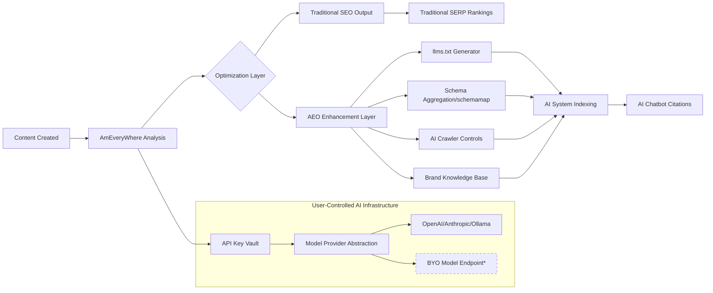

# AmEveryWhere - SEO/AEO Tool Requirements Specification

> **Document Version:** 2.1  
> **Tool Name:** AmEveryWhere  
> **Purpose:** Comprehensive SEO & Answer Engine Optimization platform for WordPress, headless CMS, and Laravel environments  
> **Last Updated:** May 2026  
> **Sources:** AIOSEO, RankMath, SurferSEO, Yoast SEO  
> **Compliance Focus:** United States (CCPA, state AI regulations)

---

## 📋 Executive Summary

SEO/AEO Tool Requirement organized by implementation phase to enable progressive development and MVP prioritization.

### ✅ Strategic Decisions Incorporated (v2.1)

| Decision | Implementation Impact |
|----------|---------------------|
| **User-Managed API Keys** | AI features require users to provide their own API keys (OpenAI, Anthropic, Ollama, etc.) with secure vault storage |
| **Free Pilot → Paid Transition** | Core SEO features free forever; AEO/advanced features behind feature flags for seamless monetization |
| **Multi-Platform Roadmap** | WordPress plugin first; headless CMS (REST API) in Phase 2; Laravel package in Phase 3 |
| **Flexible AI Model Support** | Abstracted model layer supporting popular providers + Ollama; BYO model access tiered by subscription |
| **US-First Compliance** | CCPA, state-level AI laws (CA, TX, NY), and FTC guidelines baked into data handling and AI features |

### 🎯 Key Differentiators for AmEveryWhere

- 🤖 **AI Crawler Control Suite**: Block AI bots, manage training data opt-outs, and control citation behavior
- 🗂️ **Schema Aggregation (`schemamap`)**: Machine-readable structured data endpoint optimized for AI system consumption
- 🔍 **Advanced Linguistic Intelligence**: Morphological keyword matching, inclusive language checks, complexity scoring
- 🧭 **Strategic Content Workflows**: Cornerstone content management, orphaned content detection & remediation
- 🔐 **Privacy-First AI Architecture**: User-managed API keys, US-compliant data handling, transparent AI labeling

---

## 🗂️ Requirements by Category & Priority

### 🔹 Phase 1: Core Foundation (MVP)

*Essential features for basic SEO functionality - WordPress Plugin*

#### Core SEO Foundation

| ID | Requirement | Description | Priority |
|----|-------------|-------------|----------|
| CF-001 | Meta Tag Management | Edit title tags, meta descriptions, and robots meta for all post types with live SERP preview | P0 |
| CF-002 | XML Sitemap Generator | Auto-generate search-engine compliant XML sitemaps with customizable inclusion rules | P0 |
| CF-003 | robots.txt Editor | In-dashboard editor for managing crawl directives without file access | P0 |
| CF-004 | Webmaster Tools Verification | One-click verification for Google, Bing, Yandex, Pinterest via meta tags | P0 |
| CF-005 | Canonical URL Management | Set and override canonical URLs to prevent duplicate content issues | P0 |
| CF-006 | Breadcrumb Navigation | Configurable schema-compliant breadcrumbs with theme auto-insertion | P1 |
| CF-007 | RSS Feed Optimization | Add attribution, branding, and anti-scraping elements to RSS feeds | P1 |
| CF-008 | AI Crawler Manager (Bot Blocker) | Toggle-based controls to block specific AI crawlers (GPTBot, CCBot, etc.) via robots.txt and HTTP headers | P1 |

#### Content Optimization (Basic)

| ID | Requirement | Description | Priority |
|----|-------------|-------------|----------|
| CO-001 | Focus Keyword Analysis | Analyze content against 1-5 focus keywords with actionable recommendations | P0 |
| CO-002 | On-Page SEO Checklist | Real-time checklist in editor covering keyword placement, readability, meta data | P0 |
| CO-003 | Content Scoring | Algorithmic content score (0-100) based on SEO best practices and competitor analysis | P1 |
| CO-004 | Readability Analysis | Flesch-Kincaid and sentence structure analysis for user engagement optimization | P1 |
| CO-005 | Cornerstone Content Flagging | Mark key articles as "cornerstone" with enhanced analysis strictness and internal linking prioritization | P1 |

#### Schema & Structured Data (Basic)

| ID | Requirement | Description | Priority |
|----|-------------|-------------|----------|
| SD-001 | Schema Markup Generator | Point-and-click interface for Article, Product, FAQ, HowTo, and LocalBusiness schema | P0 |
| SD-002 | Rich Snippet Preview | Live preview of how schema appears in Google SERPs | P1 |
| SD-003 | Schema Validation | Built-in validation against Google's Rich Results Test API | P1 |

#### Social Media Integration (Basic)

| ID | Requirement | Description | Priority |
|----|-------------|-------------|----------|
| SM-001 | OpenGraph & Twitter Cards | Auto-generate social meta tags with customizable fallback images | P0 |
| SM-002 | Social Preview Editor | Live preview of how content appears when shared on Facebook, X, LinkedIn | P1 |
| SM-003 | Default Share Image | Set global fallback image for content lacking featured images | P1 |

#### AI Infrastructure Foundation

| ID | Requirement | Description | Priority |
|----|-------------|-------------|----------|
| AI-INF-001 | API Key Management UI | Secure interface for users to add, rotate, and test API keys for AI providers (OpenAI, Anthropic, Ollama, etc.) | P0 |
| AI-INF-002 | Model Provider Abstraction Layer | Unified interface for multiple LLM providers with fallback logic and usage tracking | P0 |
| AI-INF-003 | AI Feature Toggle System | Feature flags to enable/disable AI capabilities per user tier (prepares for paid transition) | P0 |
| AI-INF-004 | Local Ollama Integration | Support for self-hosted Ollama instances via configurable endpoint + API key optional | P1 |
| AI-INF-005 | AI Usage Logging & Limits | Track token usage per feature/user with configurable caps to prevent unexpected costs | P1 |

#### Billing & Subscription Infrastructure (Preparation)

| ID | Requirement | Description | Priority |
|----|-------------|-------------|----------|
| BILL-001 | Feature Flag Architecture | Modular code structure allowing features to be enabled/disabled by subscription tier | P0 |
| BILL-002 | User Tier Management | Database schema for free/pro/enterprise tiers with capability mapping | P1 |
| BILL-003 | Upgrade Path UX | In-app prompts and documentation for seamless transition from free pilot to paid plans | P1 |
| BILL-004 | Usage-Based Billing Hooks | Infrastructure to track feature usage metrics for future consumption-based pricing | P2 |

#### US Compliance Foundation

| ID | Requirement | Description | Priority |
|----|-------------|-------------|----------|
| COMP-001 | CCPA Data Handling | Tools for data access requests, deletion workflows, and "Do Not Sell" signals | P1 |
| COMP-002 | AI Transparency Labels | Clear UI indicators when content is AI-generated or AI-optimized (FTC guidance) | P1 |
| COMP-003 | State AI Law Scanner | Automated checks for compliance with CA, TX, NY AI regulations (disclosure, bias testing) | P2 |
| COMP-004 | Data Residency Controls | Option to restrict AI API calls to US-based endpoints where required | P2 |

---

### 🔹 Phase 2: Growth & Optimization

*Advanced features for competitive SEO performance - WordPress + Headless CMS*

#### Advanced Content Optimization

| ID | Requirement | Description | Priority |
|----|-------------|-------------|----------|
| ACO-001 | AI Writing Assistant | Real-time SEO suggestions powered by LLM during content creation (uses user API keys) | P1 |
| ACO-002 | Content Gap Analysis | Identify missing topics/keywords compared to top-ranking competitors | P1 |
| ACO-003 | Search Intent Detection | Classify content intent (informational, commercial, navigational) and suggest optimizations | P2 |
| ACO-004 | Internal Linking Suggestions | AI-powered contextual internal link recommendations within editor | P1 |
| ACO-005 | Content Revision History | Track SEO metadata changes with version comparison and rollback | P2 |
| ACO-006 | Word Forms/Morphological Support | Recognize grammatical variations of focus keywords for more natural optimization | P2 |
| ACO-007 | Inclusive Language Checker | Flag non-inclusive phrasing and suggest accessible, bias-free alternatives | P2 |
| ACO-008 | Word Complexity Scoring | Highlight complex words and suggest simpler alternatives for broader audience accessibility | P2 |

#### Advanced Schema & Structured Data

| ID | Requirement | Description | Priority |
|----|-------------|-------------|----------|
| ASD-001 | Custom Schema Builder | Visual graph builder for complex, multi-type schema implementations | P2 |
| ASD-002 | Schema Templates & Conditions | Create reusable schema templates with display rules (post type, taxonomy, etc.) | P2 |
| ASD-003 | Schema Import Tool | Import and adapt schema markup from competitor URLs | P2 |
| ASD-004 | Video Schema Support | Auto-generate VideoObject schema with duration, thumbnail, transcript metadata | P2 |
| ASD-005 | Recipe & Event Schema | Specialized schema types for food blogs and event promotions | P2 |
| **ASD-006** | **Schema Aggregation / Schemamap** | **Consolidate all structured data into a clean, machine-readable `schemamap` endpoint optimized for AI system consumption** | **P1** |

#### Sitemaps & Indexing (Advanced)

| ID | Requirement | Description | Priority |
|----|-------------|-------------|----------|
| SI-001 | Video Sitemap Generator | Dedicated sitemap for video content per Google Video Sitemap specs | P1 |
| SI-002 | Google News Sitemap | Auto-submit eligible articles to Google News with publication metadata | P1 |
| SI-003 | IndexNow Integration | Instant URL submission to Bing, Yandex, and supported engines via IndexNow protocol | P1 |
| SI-004 | Post Index Status Checker | Query Google Indexing API to verify page indexation status with troubleshooting | P2 |
| SI-005 | Priority & ChangeFreq Controls | Fine-tune sitemap priority and update frequency signals per URL type | P2 |

#### Local & Business SEO

| ID | Requirement | Description | Priority |
|----|-------------|-------------|----------|
| LB-001 | Local Business Schema | Structured data for NAP (Name, Address, Phone), hours, geo-coordinates | P1 |
| LB-002 | Multi-Location Support | Manage schema and metadata for businesses with multiple physical locations | P2 |
| LB-003 | Contact Info Shortcode | Dynamic shortcode for displaying schema-marked contact details site-wide | P2 |
| LB-004 | Google Maps Optimization | Guidance for Google Business Profile integration and local ranking factors | P2 |

#### E-commerce SEO

| ID | Requirement | Description | Priority |
|----|-------------|-------------|----------|
| EC-001 | WooCommerce Product Schema | Auto-generate Product schema with price, availability, review, SKU fields | P1 |
| EC-002 | Category & Tag SEO | Enable meta editing and schema for product categories and tags | P1 |
| EC-003 | Review & Rating Schema | AggregateRating schema integration for product reviews and testimonials | P2 |
| EC-004 | Easy Digital Downloads Support | SEO optimization for digital product platforms beyond WooCommerce | P2 |

#### Technical SEO Tools

| ID | Requirement | Description | Priority |
|----|-------------|-------------|----------|
| TT-001 | Redirection Manager | 301/302 redirect creation with regex support, bulk import, and 404 logging | P1 |
| TT-002 | 404 Error Monitor | Track and report broken links with referrer data and one-click redirect fixes | P1 |
| TT-003 | Broken Link Checker | Crawl content for broken internal/external links and images with repair workflow | P1 |
| **TT-004** | **Orphaned Content Finder** | **Identify pages/posts with zero internal inbound links; provide bulk linking suggestions or redirect recommendations** | **P1** |
| TT-005 | .htaccess Editor | Safe in-dashboard .htaccess management with auto-backup and syntax validation | P2 |
| TT-006 | Category Base Removal | Option to strip `/category/` base from taxonomy URLs for cleaner permalinks | P2 |
| TT-007 | Attachment Redirects | Auto-redirect media attachment pages to parent post or custom URL | P2 |
| TT-008 | Front-End SEO Inspector | Overlay tool to view live meta tags, schema, and headers output on any page without viewing source | P2 |
| TT-009 | Schema Output Validator | Real-time validation of rendered schema against Google's Rich Results Test with error highlighting | P2 |

#### Content Strategy & Maintenance

| ID | Requirement | Description | Priority |
|----|-------------|-------------|----------|
| CS-001 | Stale Cornerstone Detector | Automatically flag cornerstone content that hasn't been updated in X months with refresh recommendations | P2 |
| CS-002 | Orphaned Content Workout | Guided workflow to fix orphaned pages via internal linking, category assignment, or archival | P2 |
| CS-003 | Content Audit Scheduler | Schedule recurring SEO audits with email reports and prioritized action items | P2 |

#### Headless CMS & API Support

| ID | Requirement | Description | Priority |
|----|-------------|-------------|----------|
| HEAD-001 | REST API: SEO Metadata Endpoints | CRUD endpoints for managing SEO data on headless WordPress/decoupled sites | P1 |
| HEAD-002 | Webhook Integration | Trigger SEO audits, sitemap updates, or AI optimizations via external webhooks | P2 |
| HEAD-003 | GraphQL Support | Optional GraphQL schema for SEO fields to support modern headless stacks | P2 |
| HEAD-004 | Static Site Generator Compatibility | Export optimized meta/schema for Next.js, Nuxt, Hugo, etc. via build hooks | P2 |

---

### 🔹 Phase 3: Enterprise & AI-First

*Cutting-edge features for AEO, AI visibility, and team collaboration - WordPress + Headless + Laravel*

#### AI & Answer Engine Optimization (AEO)

| ID | Requirement | Description | Priority |
|----|-------------|-------------|----------|
| AI-001 | llms.txt Generator | Auto-generate and manage `llms.txt` files to control AI crawler access and citation | P1 |
| AI-002 | AI Visibility Tracker | Monitor brand mentions, citations, and visibility across ChatGPT, Perplexity, Gemini | P1 |
| AI-003 | Prompt Performance Tracking | Track how content performs against specific AI search prompts with refresh scheduling | P2 |
| AI-004 | Brand Knowledge Base | Curate brand facts, tone, and key messages to improve AI model citation accuracy | P2 |
| AI-005 | AI Content Generator | One-click generation of meta descriptions, FAQs, social posts, and content outlines via LLM (user API keys) | P2 |
| AI-006 | AI Image Generator | Create optimized, unique images from text prompts with automatic alt-text generation | P3 |
| AI-007 | Mention Gap & Sentiment Analysis | Identify where competitors are cited in AI responses and analyze brand sentiment | P2 |
| **AI-008** | **AI Training Data Opt-Out** | **One-click implementation of `robots.txt` and meta tags to prevent content use in AI model training** | **P1** |
| **AI-009** | **AI Content Planner** | **Analyze existing content to suggest topic gaps and generate structured outlines for new cornerstone pieces** | **P2** |
| AI-010 | BYO Model Gateway | Allow enterprise users to connect custom fine-tuned models or private LLM endpoints (subscription-tier gated) | P3 |

#### Analytics, Reporting & Rank Tracking

| ID | Requirement | Description | Priority |
|----|-------------|-------------|----------|
| AR-001 | Google Search Console Integration | Pull impressions, clicks, CTR, and query data directly into dashboard | P0 |
| AR-002 | Keyword Rank Tracker | Monitor keyword positions across locations/devices with historical trend charts | P1 |
| AR-003 | SEO Audit Tool | Automated site-wide audit across 40+ technical and on-page factors with prioritized fixes | P1 |
| AR-004 | Performance Reports | Scheduled email/PDF reports with traffic trends, ranking changes, and action items | P2 |
| AR-005 | Cannibalization Detection | Identify pages competing for same keywords with consolidation recommendations | P2 |
| AR-006 | Rank Drop Alerts | Real-time notifications for significant position drops with diagnostic suggestions | P2 |
| AR-007 | PageSpeed Integration | Display Core Web Vitals and loading metrics per URL within WordPress admin | P2 |

#### User Management & Collaboration

| ID | Requirement | Description | Priority |
|----|-------------|-------------|----------|
| UM-001 | Custom SEO User Roles | Granular permissions for who can edit SEO settings, view reports, or manage redirects | P1 |
| UM-002 | Multi-Brand Workspaces | Isolated SEO environments for agencies managing multiple client brands | P2 |
| UM-003 | Team Collaboration Tools | Comments, task assignments, and approval workflows for SEO content reviews | P2 |
| UM-004 | Activity & Version Logs | Audit trail of SEO setting changes with user attribution and rollback capability | P2 |
| UM-005 | Client Reporting Portal | White-labeled dashboard for sharing SEO performance with clients | P3 |
| **UM-006** | **Content Workflow States** | **Draft → Review → Approved → Published status tracking with SEO gatekeeping rules** | **P3** |

#### Integrations & Extensibility

| ID | Requirement | Description | Priority |
|----|-------------|-------------|----------|
| IN-001 | Page Builder Integrations | Native SEO controls within Elementor, Divi, WPBakery, Avada, SeedProd editors | P1 |
| IN-002 | REST API Support | Full CRUD API for headless WordPress SEO management and external tool integration | P2 |
| IN-003 | WordPress Multisite Support | Centralized or per-site SEO configuration for multisite networks | P1 |
| IN-004 | Third-Party Importers | One-click migration from Yoast SEO, AIOSEO, and other plugins with settings mapping | P0 |
| IN-005 | Zapier/Make Integration | Webhook support for connecting AmEveryWhere events to external automation platforms | P3 |
| IN-006 | Google Analytics 4 Integration | Display GA4 traffic and behavior metrics alongside SEO data in unified dashboard | P2 |
| **IN-007** | **Google Docs SEO Add-on** | **Browser extension to run SEO/readability analysis directly in Google Docs with sync to WordPress** | **P3** |
| IN-008 | Laravel Package Foundation | Core SEO logic extracted for future Laravel package with service providers and config publishing | P3 |

#### Performance, Maintenance & Developer Tools

| ID | Requirement | Description | Priority |
|----|-------------|-------------|----------|
| PM-001 | Lightweight Architecture | Modular code loading; disable unused features to minimize frontend impact | P0 |
| PM-002 | Import/Export Settings | Backup and migrate all AmEveryWhere settings via JSON with encryption option | P1 |
| PM-003 | Version Control & Rollback | Safely test beta versions or revert to previous plugin versions from dashboard | P2 |
| PM-004 | Compatibility Checker | Pre-installation scan for theme/plugin conflicts and server requirement validation | P0 |
| PM-005 | Bulk SEO Editor | Mass-edit titles, descriptions, robots tags, and schema across hundreds of posts | P1 |
| PM-006 | Quick Edit SEO Fields | Edit core SEO metadata directly from WordPress post list view | P1 |
| PM-007 | Cross-Platform Core Library | Extract platform-agnostic SEO logic into shared library for WordPress/Laravel/headless reuse | P3 |

---

## 🔄 Comprehensive Deduplication Summary

| Original Feature Names (Across Sources) | Consolidated Requirement ID | Notes |
|--------------------------------------|----------------------------|-------|
| "Smart XML Sitemaps", "XML Sitemap", "Sitemap" | CF-002 | Unified sitemap generator with advanced options |
| "Schema Markup", "Rich Snippets", "Structured Data" | SD-001 to ASD-006 | Tiered schema implementation from basic to AI-optimized aggregation |
| "TruSEO Analysis", "SEO Analysis", "Content Score" | CO-001 to CO-004 | Layered content optimization scoring |
| "Link Assistant", "Internal Linking", "Link Builder" | ACO-004 | Single intelligent internal linking system |
| "Redirection Manager", "404 Monitor", "Broken Link Checker" | TT-001 to TT-003 | Integrated technical error management suite |
| "Social Previews", "OpenGraph", "Twitter Cards" | SM-001 to SM-003 | Unified social metadata management |
| "AI Writing Assistant", "Content AI", "AI Content Generator" | ACO-001, AI-005 | Separated real-time assistance vs. generative content |
| "Rank Tracker", "Keyword Monitoring", "Position History" | AR-002 | Comprehensive rank tracking with analytics |
| "Page Builder Integration" (multiple entries) | IN-001 | Single integration framework supporting all major builders |
| "Cornerstone Content", "Focus Content" | CO-005, CS-001 | Unified cornerstone strategy with maintenance workflow |
| "Orphaned Content", "Unlinked Content" | TT-004, CS-002 | Combined detection and guided remediation workflow |
| "AI Bot Blocking", "Crawler Control" | CF-008, AI-008 | Unified AI crawler management suite |
| "Inclusive Language", "Readability Enhancements" | ACO-007, ACO-008 | Advanced linguistic intelligence layer |
| "API Management", "AI Keys", "Model Selection" | AI-INF-001 to AI-INF-005 | Centralized AI infrastructure with user-controlled keys |
| "Billing Setup", "Subscription Prep" | BILL-001 to BILL-004 | Foundation for seamless free→paid transition |

---

## 🎯 Implementation Roadmap Guidance

### MVP Launch (Phase 1) - Target: Q3 2026

**Platform:** WordPress Plugin Only  
**Pricing:** Free Pilot (all core features enabled)  
**Focus Areas:**

- ✅ Core SEO Foundation (CF-001 to CF-008)
- ✅ Basic Content Optimization (CO-001 to CO-005)
- ✅ Basic Schema & Social (SD-001 to SM-003)
- ✅ AI Infrastructure: API Key Management, Model Abstraction, Feature Flags (AI-INF-001 to AI-INF-005)
- ✅ Billing Prep: Feature flag architecture, tier schema (BILL-001, BILL-002)
- ✅ US Compliance: CCPA workflows, AI transparency labels (COMP-001, COMP-002)

**Success Metrics:**

- Plugin activation to first optimization: <5 minutes
- Core Web Vitals impact: <20ms added load time
- 95%+ compatibility with top 20 WordPress themes
- Zero critical security vulnerabilities in API key handling

### Growth Phase (Phase 2) - Target: Q1 2027

**Platform:** WordPress + Headless CMS (REST API)  
**Pricing:** Free tier + Pro tier launch (feature-flag gated)  
**Focus Areas:**

- 🚀 Advanced content intelligence (morphology, inclusive language)
- 🚀 Technical SEO suite (orphaned content, front-end inspector)
- 🚀 Schema aggregation (`schemamap`) for AEO readiness
- 🚀 Local & e-commerce vertical expansions
- 🚀 Headless CMS support via REST API endpoints (HEAD-001 to HEAD-004)
- 🚀 Paid tier activation: Upgrade UX, usage tracking (BILL-003, BILL-004)

**Success Metrics:**

- 30% improvement in content optimization completion rates
- 50% reduction in orphaned page reports for active users
- Schema validation pass rate: >98%
- Free→Pro conversion rate: ≥5% of active users

### Enterprise/AEO Phase (Phase 3) - Target: Q3 2027

**Platform:** WordPress + Headless CMS + Laravel Package  
**Pricing:** Free / Pro / Enterprise tiers with BYO model options  
**Focus Areas:**

- 🤖 Full AI crawler control & training data opt-out
- 🤖 AI visibility tracking across major LLM platforms
- 🤖 Team collaboration & white-label reporting
- 🤖 Laravel package release with service providers (IN-008, PM-007)
- 🤖 Enterprise features: BYO model gateway, advanced compliance (AI-010, COMP-003)

**Success Metrics:**

- AI citation tracking accuracy: >90%
- Agency workspace adoption: 25% of enterprise tier
- API uptime SLA: 99.9%
- Laravel package adoption: 1,000+ installs in first quarter

---

## ⚠️ Non-Functional Requirements

| Category | Requirement | Acceptance Criteria |
|----------|-------------|-------------------|
| **Performance** | Plugin must add <50ms to page load when active; lazy-load non-critical modules | Lighthouse performance score impact ≤3 points |
| **Security** | All user inputs sanitized; nonces for AJAX; capability checks; API keys encrypted at rest | Pass WordPress VIP security scan; zero critical CVEs; keys never logged |
| **Compatibility** | WordPress 6.0+, PHP 7.4+, tested with top 20 themes and page builders | 99%+ successful installs across test matrix |
| **Accessibility** | Admin UI meets WCAG 2.1 AA standards; keyboard-navigable controls | axe-core audit: zero critical violations |
| **Internationalization** | Full translation readiness; RTL support; multi-currency for e-commerce fields | 100% string coverage in .pot file; RTL layout validation |
| **Data Privacy (US)** | CCPA-compliant data handling; "Do Not Sell" signals; data export/delete workflows | Legal review sign-off; user request fulfillment <45 days |
| **AI Ethics & Transparency** | Clear labeling of AI-generated/optimized content; user control over data usage | FTC-compliant disclosures; opt-in flows for all AI features |
| **Scalability** | Support sites with 10k+ posts; database queries optimized with indexing | Query execution <100ms at 10k post scale |
| **Cross-Platform Architecture** | Core logic abstracted for WordPress, headless, Laravel reuse | 80%+ code reuse across platform implementations |
| **Billing Readiness** | Feature flags and usage tracking in place before monetization launch | Zero downtime during free→paid transition; accurate usage metering |

---

## 🧭 AEO-Specific Architecture Considerations



**Key Technical Decisions:**

1. **Dual-Output Architecture**: Maintain parallel optimization paths for traditional search and AI answer engines
2. **Schema-First Design**: All structured data generated with both Google Rich Results AND LLM consumption in mind
3. **Crawler Intelligence**: User-agent detection to serve optimized content variants for AI bots vs. traditional crawlers
4. **Attribution Tracking**: Embed lightweight, privacy-safe markers to help trace AI citations back to source content
5. **User-Key Security**: API keys encrypted at rest, never transmitted to AmEveryWhere servers, with local validation where possible
6. **Model Abstraction**: Unified prompt/response interface allowing seamless switching between providers without code changes

---

## ✅ Resolved Strategic Questions

| # | Question | Decision | Implementation Notes |
|---|----------|----------|---------------------|
| 1 | **AI API Strategy**: User-provided vs. AmEveryWhere-managed keys? | ✅ **User-Managed Keys** | - Secure vault UI with encryption at rest<br>- Local validation for Ollama/self-hosted<br>- Usage tracking to prevent cost surprises<br>- Clear documentation for key setup per provider |
| 2 | **Pricing Model**: How to structure free pilot → paid transition? | ✅ **Free Pilot + Feature Flags** | - Core SEO features free forever<br>- AEO/advanced features behind feature flags<br>- Tier schema (free/pro/enterprise) in DB from Day 1<br>- Upgrade prompts contextual to feature access |
| 3 | **Platform Roadmap**: WordPress first, then what? | ✅ **WordPress → Headless → Laravel** | - Phase 1: WordPress plugin only<br>- Phase 2: REST API for headless CMS<br>- Phase 3: Laravel package with service providers<br>- Shared core library (PM-007) enables code reuse |
| 4 | **AI Model Support**: Which providers? BYO option? | ✅ **Popular Providers + Ollama + Tiered BYO** | - Support OpenAI, Anthropic, Google, Ollama at launch<br>- Abstracted provider layer for easy additions<br>- BYO model endpoint gated to Enterprise tier (AI-010)<br>- Clear documentation for self-hosted Ollama setup |
| 5 | **Compliance Scope**: Which regulations first? | ✅ **United States Focus** | - CCPA workflows for data rights<br>- FTC-compliant AI transparency labels<br>- Scanner for CA/TX/NY state AI laws (COMP-003)<br>- Data residency controls for US-endpoint enforcement |

---

## 📋 Appendix: Feature Flag Configuration Example

```yaml
# config/ameverywhere-features.yaml
# Used by BILL-001: Feature Flag Architecture

core_seo:
  meta_tags: { enabled: true, tiers: [free, pro, enterprise] }
  xml_sitemaps: { enabled: true, tiers: [free, pro, enterprise] }
  schema_basic: { enabled: true, tiers: [free, pro, enterprise] }

ai_optimization:
  writing_assistant: { enabled: true, tiers: [pro, enterprise], requires_api_key: true }
  content_generator: { enabled: true, tiers: [pro, enterprise], requires_api_key: true }
  ai_crawler_manager: { enabled: true, tiers: [free, pro, enterprise] } # Core compliance feature

aeo_advanced:
  schemamap: { enabled: true, tiers: [pro, enterprise] }
  ai_visibility_tracker: { enabled: true, tiers: [enterprise] }
  byo_model_gateway: { enabled: true, tiers: [enterprise] }

collaboration:
  workflow_states: { enabled: true, tiers: [enterprise] }
  client_portal: { enabled: true, tiers: [enterprise] }

compliance:
  ccpa_tools: { enabled: true, tiers: [free, pro, enterprise] }
  state_ai_scanner: { enabled: true, tiers: [pro, enterprise] }
```

---
